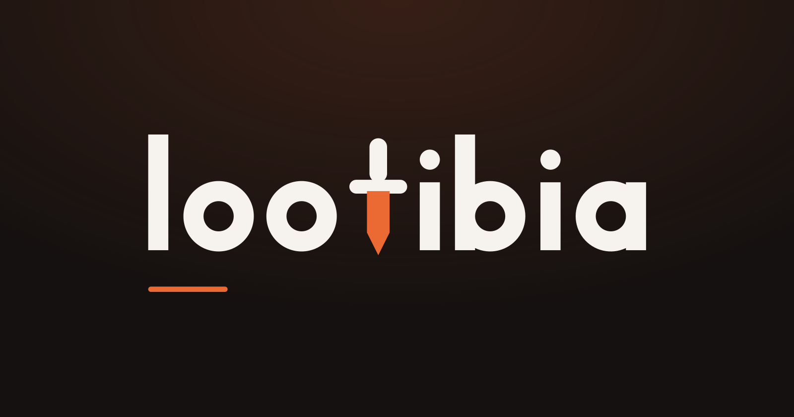
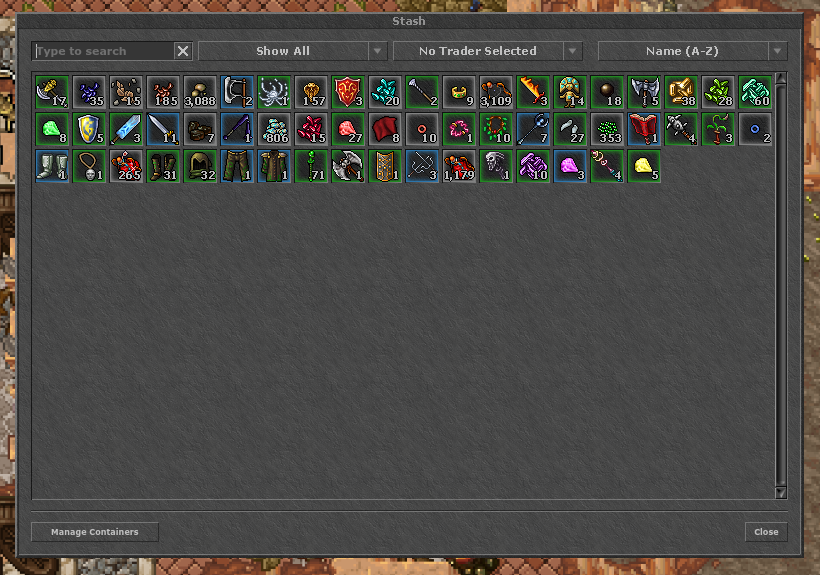
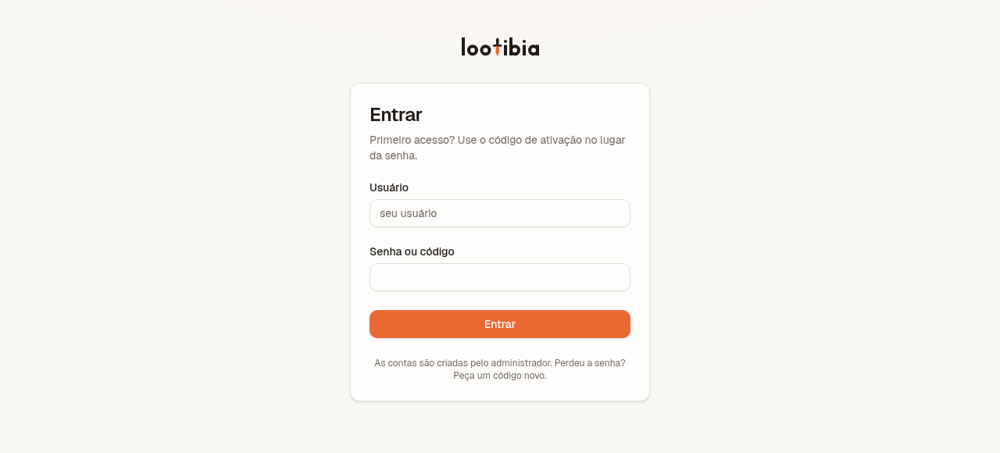

<p align="center">
  
</p>

<p align="center">
  Analisador de hunts e caixa de ferramentas para jogadores de Tibia.<br>
  <a href="https://lootibia.vercel.app">lootibia.vercel.app</a>
</p>

---

## O problema

Quem joga Tibia a sério acompanha o próprio farm: quanto lucrou em cada hunt, quanta experiência
fez por hora, se a meta da semana está perto. O jogo mostra esses números no **Hunt Analyser**,
mas esquece tudo quando a sessão termina. O que sobra é o jogador copiando os números para uma
**planilha de farm** ou para um **caderninho** — à mão, sessão por sessão, com a conta de médias
feita do jeito errado quase sempre.

O **lootibia** substitui essa planilha. O jogador cola o texto que o Hunt Analyser copia, e o app
guarda a sessão na conta dele, organiza em pastas e faz as contas certas. Em cima desses dados
reais vêm as ferramentas: ler o Stash por um print, prever quando o personagem chega a um level.

> **Uso fechado.** Não há cadastro aberto: as contas são criadas pelo administrador (ver
> [Criar uma conta](#5-criar-uma-conta)). O código é público; a instância no ar, não.

## O que ele faz

| | |
|---|---|
| **Analisador de hunts** | Cola o texto do Hunt Analyser, o app parseia e guarda a sessão. Mostra os acumulados por pasta — profit, loot, supplies, XP e XP Raw, médias por hora, mobs mortos e hunts mais caçadas — e abre cada sessão num analyzer próprio. |
| **Pastas e metas** | Pastas criadas e nomeadas pelo jogador, cada uma com meta opcional em Tibia Coin ou em gold. A meta guarda valor e unidade, nunca o equivalente em gold, porque o preço da TC muda. |
| **Drops extras** | O item raro que o jogo avalia mal (pelo preço de NPC) é anotado com o valor que o jogador dá, e somado **à parte** do profit, para não misturar número medido com estimativa. |
| **Stash analyzer** | Lê prints da janela do Stash **no próprio navegador** — o print não sai da máquina — e diz o que serve para Delivery Task, para imbuement e quanto tudo vale no NPC. |
| **Prever level** | Diz quando o personagem chega a um level, pelo XP/h real das hunts dele, e não por uma média inventada. |
| **Faixa do dia** | Criatura e boss boostados do dia e onde o Rashid está, respeitando o server save (10:00 de Berlim). |

<p align="center">
  
  <br>
  <sub>Um print que o Stash analyzer lê inteiro: 57 itens e quantidades, com molduras coloridas.</sub>
</p>

## Duas regras de cálculo que não se negociam

- **Toda taxa é `Σ total / Σ horas`**, nunca a média das médias por sessão. Uma hunt de 10 min com
  XP/h inflado pesaria igual a uma de 4 h. No caso real testado a diferença foi de 120 mil/h contra
  350 mil/h.
- **`Balance` e as taxas `/h` do texto não são gravadas.** `Balance` é `Loot − Supplies`, e os `/h`
  do jogo não são reproduzíveis por nenhuma duração única.

## Passo a passo para rodar

### Pré-requisitos

- [Node.js](https://nodejs.org) **22.18 ou mais novo** (os testes e os scripts rodam TypeScript
  direto no Node, sem compilar) e o `npm`, que vem junto.
- [Git](https://git-scm.com).
- Uma conta gratuita no [Supabase](https://supabase.com) — é o banco e o login.

O Stash analyzer e a previsão de level não precisam de nada além disso. Regerar a base do Stash
(opcional, ver [Scripts](#scripts)) precisa do cliente do Tibia instalado e do `xz`.

### 1. Baixar e instalar

```bash
git clone https://github.com/DaviGons/lootibia.git
cd lootibia
npm install
```

### 2. Criar o banco no Supabase

1. Crie um projeto em [supabase.com](https://supabase.com) (o plano Free basta).
2. No **SQL Editor**, rode as seis migrations **na ordem**, uma por vez:
   [`0001_schema.sql`](supabase/migrations/0001_schema.sql),
   [`0002_personagem_e_perfil.sql`](supabase/migrations/0002_personagem_e_perfil.sql),
   [`0003_pastas_e_metas.sql`](supabase/migrations/0003_pastas_e_metas.sql),
   [`0004_drops_extras.sql`](supabase/migrations/0004_drops_extras.sql),
   [`0005_endurecimento.sql`](supabase/migrations/0005_endurecimento.sql) e
   [`0006_personagem_so_nome.sql`](supabase/migrations/0006_personagem_so_nome.sql).
   Elas criam as tabelas, a view de período e **todas as políticas de RLS** (cada usuário só
   enxerga os próprios dados).
3. Em **Authentication → Sign In / Providers**, **desligue "Allow new users to sign up"**. Sem isso
   a API do Supabase aceita cadastro de quem souber o caminho, mesmo sem tela de cadastro.
4. Ainda em **Authentication**, ponha o **tamanho mínimo de senha em 8**.

> O plano Free **pausa o projeto após 1 semana sem uso**. Se o site parar de responder, reative o
> projeto no painel do Supabase.

### 3. Configurar as chaves

```bash
cp .env.example .env.local
```

Em **Project Settings → API Keys** do Supabase, copie para o `.env.local`:

| Variável | De onde vem |
|---|---|
| `NEXT_PUBLIC_SUPABASE_URL` | a URL do projeto (`https://….supabase.co`) |
| `NEXT_PUBLIC_SUPABASE_PUBLISHABLE_KEY` | a chave publicável (`sb_publishable_…`) |
| `SUPABASE_SECRET_KEY` | a chave secreta (`sb_secret_…`) — **só nesta máquina, nunca na Vercel** |

A chave secreta ignora todas as regras de acesso do banco; ela serve só para o script que cria
contas. O site no ar não precisa dela.

### 4. Subir o app

```bash
npm run dev
```

Abra <http://localhost:3000>. Sem o `.env.local` preenchido o app sobe mesmo assim, e a tela diz o
que falta em vez de quebrar.

### 5. Criar uma conta

Não existe tela de cadastro. Com o app rodando ou não, em outro terminal:

```bash
node --experimental-strip-types --env-file=.env.local scripts/criar-usuario.ts avaliador
```

Ele imprime o usuário e um **código de ativação**. Entre em <http://localhost:3000> com esse
usuário e, no lugar da senha, o código: o site pede para escolher uma senha na hora.

<p align="center">
  
</p>

- `--resetar` sorteia um código novo para quem esqueceu a senha.
- `--listar` mostra as contas e quem ainda não trocou o código.
- `--expirar` derruba os códigos parados há mais de 7 dias.

### 6. Experimentar

- **Hunt:** clique em **Adicionar nova hunt** na lateral e cole o conteúdo de
  [`exemplos/hunt-analyser-lost-souls.txt`](exemplos/hunt-analyser-lost-souls.txt) — o texto que
  o Hunt Analyser do jogo copia. Crie uma pasta e mova a hunt para ela para ver os acumulados.
- **Personagem:** em **Configurações**, cadastre um personagem de Tibia que exista (ex.: o seu). O
  app confere na [TibiaData](https://tibiadata.com) e guarda mundo, vocação e level.
- **Stash analyzer:** em **Ferramentas → Stash analyzer**, solte os prints de
  [`test/fixtures/stash/`](test/fixtures/stash/). O de 2026-09-29 tem 57 itens, com molduras
  coloridas e itens não empilháveis.
- **Prever level:** em **Calculadoras → Prever level**, escolha o personagem e o level-alvo. Com
  hunts importadas, a conta usa o XP/h real delas.

### 7. Rodar os testes

```bash
npm test
```

Roda os 11 arquivos de teste de `lib/` pelo executor nativo do Node. Nenhum deles toca a rede: os
parsers e o leitor do Stash são testados contra textos e prints reais gravados em
[`test/fixtures/`](test/fixtures/). A validação completa, que tem de passar antes de qualquer
commit, é:

```bash
npx tsc --noEmit
npx eslint .
npm run build
npm test
```

Dois testes ficam fora, porque falam com o banco de verdade: eles pegam uma classe de bug que teste
de unidade não pega — **política de RLS faltando nega em silêncio, e a API ainda responde `200`**.
Cada um cria duas contas descartáveis, testa logado nelas e apaga as duas no fim:

```bash
node --experimental-strip-types --env-file=.env.local scripts/testar-pastas.ts
node --experimental-strip-types --env-file=.env.local scripts/testar-extras.ts
```

### 8. Publicar na Vercel (opcional)

1. Importe o repositório na [Vercel](https://vercel.com) (o plano Hobby basta).
2. Em **Environment Variables**, ponha **só** `NEXT_PUBLIC_SUPABASE_URL` e
   `NEXT_PUBLIC_SUPABASE_PUBLISHABLE_KEY`. A chave secreta não vai.
3. Cada push na `main` publica sozinho.

## Como funciona por dentro

- **Next.js 16** (App Router, Cache Components) no servidor e na tela; **Supabase** (Postgres +
  Auth) como banco e login; **Tailwind** no visual; **Vercel** para publicar. Tudo em plano
  gratuito, e o projeto foi dimensionado para caber nele (500 MB de banco).
- **Segurança no banco, não na tela.** Toda tabela tem RLS: a chave que roda no navegador só lê e
  grava o que é do usuário logado. As regras estão nas migrations e são testadas contra o banco
  real.
- **Hunt Analyser → banco.** O parser ([`lib/huntSession.ts`](lib/huntSession.ts)) transforma o
  texto em dados tipados; nome de item e de criatura vira tabela de lookup, para não repetir texto
  em milhares de linhas.
- **Stash analyzer é visão computacional no navegador.** Um Web Worker acha a janela pelo título
  "Stash" em qualquer posição e resolução (100% ou 200%), recorta cada slot e compara com os ~9.600
  sprites da base: primeiro um filtro por assinatura de cor em grade 8×8, depois comparação pixel a
  pixel nos candidatos. A quantidade é lida por OCR próprio sobre a fonte do jogo. O motor está em
  [`lib/stash.ts`](lib/stash.ts), com cada medida anotada e testada contra prints reais.
- **Dados do jogo vêm de fontes públicas**: [TibiaData](https://tibiadata.com) (personagens,
  boostados), [TibiaWiki](https://tibia.fandom.com) (Delivery Tasks, imbuements) e os arquivos do
  cliente do Tibia (sprites e preços de NPC, para a base do Stash).

As decisões de projeto, cada uma com o problema que a motivou, estão em
[`docs/decisoes.md`](docs/decisoes.md). As regras de trabalho no repositório, em
[`AGENTS.md`](AGENTS.md).

## Estrutura

| Caminho | O que é |
|---|---|
| `app/(app)/hunts/` | Hunts: importar, listar, apagar, pastas, metas, drops extras |
| `app/(app)/ferramentas/stash/` | Stash analyzer: página, tela de resultado e o Web Worker que lê |
| `app/(app)/calculadoras/level/` | Previsão de level |
| `app/(app)/config/` | Personagens, preço da Tibia Coin por mundo, troca de senha |
| `app/auth/` | Login e definição de senha |
| `components/` | Lateral, analyzer da sessão, janela de importação e o resto da interface |
| `lib/huntSession.ts` | Parser do texto do Hunt Analyser |
| `lib/huntAgregado.ts` | Agregação das métricas (`Σ total / Σ horas`) |
| `lib/importacao.ts` | Uma sessão parseada indo para o banco |
| `lib/stash.ts` | Motor do Stash analyzer: janela, slots, sprites, molduras, OCR |
| `lib/level.ts` | Curva de XP do jogo e previsão de level |
| `lib/meta.ts` · `lib/moedas.ts` | Progresso da meta da pasta e conversão TC ↔ gp |
| `lib/periodo.ts` · `lib/rashid.ts` | Dia e semana do jogo; onde o Rashid está hoje |
| `lib/tibiadata.ts` · `lib/tibiawiki.ts` | Clientes únicos das duas APIs públicas |
| `lib/conta.ts` | Login por usuário, código de ativação |
| `lib/dados/` | Bases geradas por script: criaturas e itens do Stash |
| `public/stash/sprites.png` | Atlas com os sprites que o Stash analyzer compara |
| `scripts/` | Ferramentas de linha de comando, rodadas à mão |
| `supabase/migrations/` | O banco inteiro, em SQL |
| `test/fixtures/` | Textos e prints reais usados pelos testes |
| `exemplos/` | Arquivos para experimentar o app |
| `docs/` | Referências verificadas contra as APIs e o registro de decisões |

## Scripts

Todos rodam com `node --experimental-strip-types --env-file=.env.local scripts/<nome>.ts`.

| Script | Para quê |
|---|---|
| `criar-usuario.ts` | Criar conta, resetar código, listar, expirar códigos parados |
| `testar-pastas.ts` · `testar-extras.ts` | Testes contra o banco de verdade (RLS) |
| `atualizar-stash.ts` | Regerar a base e o atlas do Stash a partir do cliente do Tibia e do TibiaWiki |
| `atualizar-criaturas.ts` | Regerar a lista de criaturas e sprites |
| `conferir-itens.ts` | Medir se todo item do banco acha a página no wiki |
| `gerar-marca.ts` | Regerar as imagens da marca a partir do vetor |

## Documentação

- [`docs/hunt-analyser.md`](docs/hunt-analyser.md) — o formato do texto do jogo e o dimensionamento do banco.
- [`docs/tibia-apis.md`](docs/tibia-apis.md) — as duas APIs públicas como elas respondem de verdade.
- [`docs/stack.md`](docs/stack.md) — limites reais dos planos gratuitos e como o projeto cabe neles.
- [`docs/periodos.md`](docs/periodos.md) — o calendário do jogo (server save, horário de Berlim).
- [`docs/decisoes.md`](docs/decisoes.md) — registro de decisões.

## Créditos

Tibia e todos os produtos relacionados são © CipSoft GmbH. Este projeto não é afiliado à CipSoft.
Dados de [tibia.com](https://www.tibia.com) via [TibiaData](https://tibiadata.com), e do
[TibiaWiki](https://tibia.fandom.com) via [tibiawiki.dev](https://tibiawiki.dev) e da API do
Fandom. Os sprites do Stash analyzer são extraídos do cliente do Tibia instalado.
